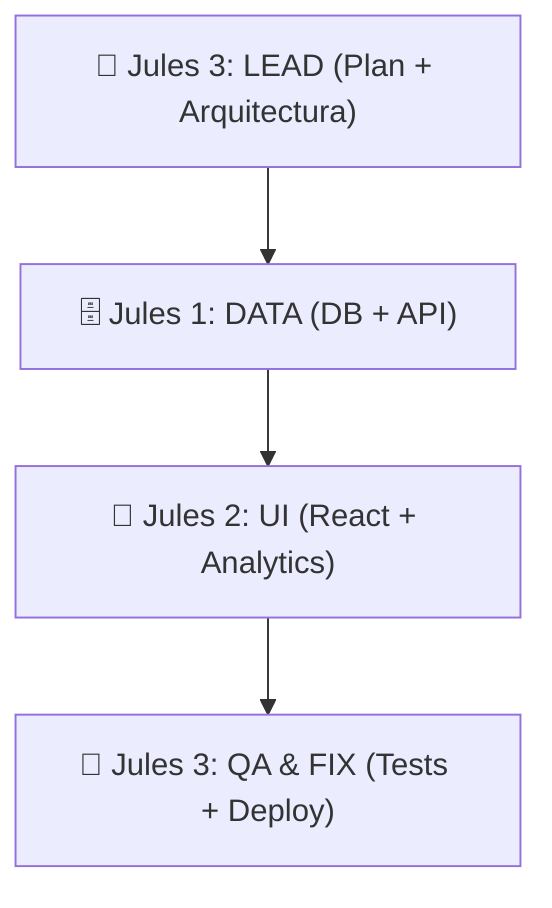

# ⚓ PIPELINE — Swarm de 3 Unidades (Optimizado)

> **Orden de ejecución basado en hardware y herramientas (MCPs).**

---

## Flujo de Trabajo

## Unidades Jules

### 1. 🧠 LEAD ORCHESTRATOR (Jules 3)
- **Responsable:** Planificación inicial, coordinación de cambios estructurales y control de calidad final.
- **Poderes:** Context7 + RAG (n8n/Qdrant) + Render MCP.
- **Cuándo actúa:** Al principio del ticket y al final del pipeline.

### 2. 🗄️ DATA MASTER (Jules 1)
- **Responsable:** Creación de tablas, RLS, funciones SQL y lógica de negocio en el servidor.
- **Poderes:** Supabase MCP + NeonMCP.
- **Cuándo actúa:** Después de que el Lead defina el contrato de arquitectura.

### 3. 🎨 UI & ANALYTICS ENGINE (Jules 2)
- **Responsable:** Implementación de la vista, diseño visual y analíticas en tiempo real.
- **Poderes:** Tinybird MCP.
- **Cuándo actúa:** Después de que el Data Master tenga los endpoints y schemas listos.

---

## ¿Cómo manejar errores de CI? (Loop Autocurativo)

1. El CI falla.
2. El **Jules 3 (LEAD)** se activa automáticamente.
3. Lee los logs.
4. Usa **Context7** para ver por qué falló el import o el tipo.
5. Aplica el fix y pushea.

## Ventajas de este planteamiento de 3 Agentes:
1. **Alineación 1:1:** Cada cuenta tiene las herramientas que necesita para su rol. No hay confusión de identidad.
2. **Contexto Superior:** Al delegar la arquitectura al Jules con acceso al RAG, el diseño siempre será coherente con el resto del repo.
3. **Eficiencia de Coste:** Aprovechas al máximo los 100 usos diarios de cada una de las 3 cuentas sin desperdiciar tokens en "roles redundantes".
