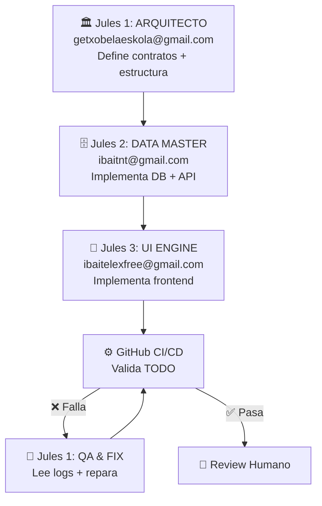

# ⚓ PIPELINE — Swarm de 3 Agentes (v2 Corregido)

> **Orden de ejecución basado en las personas reales y sus herramientas (MCPs).**

---

## Flujo de Trabajo

## Identidad de los Agentes

### 1. 🏛️ LEAD ORCHESTRATOR / ARQUITECTO (Jules 1)
- **Persona:** Urko (getxobelaeskola@gmail.com)
- **API Key:** `JULES_API_KEY`
- **Responsable:** Planificación, contratos API, tipos TypeScript, QA final, auto-fix CI.
- **MCPs:** Supabase MCP + Neon MCP
- **Branches:** `jules/arch-*`, `jules/fix-*`
- **Cuándo actúa:** Al principio (define contratos) y al final (QA + fix).

### 2. 🗄️ DATA MASTER (Jules 2)
- **Persona:** Ibai NT (ibaitnt@gmail.com)
- **API Key:** `JULES_API_KEY_2`
- **Responsable:** Tablas, RLS, funciones SQL, API routes, lógica de negocio.
- **MCPs:** Tinybird MCP
- **Branches:** `jules/data-*`
- **Cuándo actúa:** Después de que el Arquitecto defina los contratos.

### 3. 🎨 UI & ANALYTICS ENGINE (Jules 3)
- **Persona:** Ibai Telex (ibaitelexfree@gmail.com)
- **API Key:** `JULES_API_KEY_3`
- **Responsable:** Componentes React, páginas, diseño visual, deploy.
- **MCPs:** Context7 MCP + Render MCP
- **Branches:** `jules/ui-*`
- **Cuándo actúa:** Después de que el Data Master tenga endpoints listos.

---

## Reglas de Oro

1. **Frontend NUNCA inventa endpoints.** Solo consume lo que Data Master implementó.
2. **Arquitecto NO toca implementación.** Solo define contratos y hace QA.
3. **Nadie toca carpeta ajena.** El CI detecta y alerta si un Jules se pisa.
4. **CI/CD es el juez.** Todo pasa por GitHub Actions antes del merge.

## ¿Cómo manejar errores de CI? (Loop Autocurativo)

1. El CI falla en un PR de cualquier Jules.
2. **Jules 1 (Arquitecto)** se activa automáticamente en modo fixer.
3. Lee los logs de CI + consulta RAG para contexto.
4. Aplica el fix y pushea a la misma rama.
5. Máximo 3 intentos. Si falla → Telegram a los 3 humanos.

## Ventajas de este pipline:
1. **Alineación 1:1:** Cada persona tiene su Jules con las herramientas exactas.
2. **Sin colisiones:** Carpetas separadas + CODEOWNERS + branch naming.
3. **Eficiencia:** 300 tareas/día totales (100 por cuenta).
4. **Pipeline serial:** Arch → Data → UI reduce errores en cascada.
