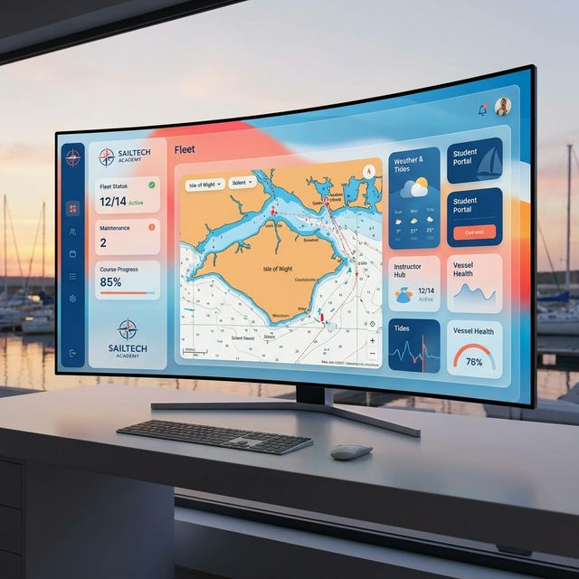

<<<<<<< HEAD
# ⚓ Getxo Bela Eskola

[](https://github.com/ibaitelexfree-creator/getxobelaeskola/actions/workflows/ci.yml)
[](https://github.com/ibaitelexfree-creator/getxobelaeskola/actions/workflows/security.yml)
[](https://ibaitelexfree-creator.github.io/getxobelaeskola/)
[](https://github.com/ibaitelexfree-creator/getxobelaeskola/pkgs/container/getxobelaeskola-web)

> **Modern Enterprise OS for Sailing Schools.** 
> A comprehensive SaaS platform for high-performance sailing academies, fleet management, and automated educational orchestration.



---

## 💎 Core Pillars

- **🚀 Academy OS:** Full LMS for nautical certifications.
- **⚓ Fleet Commander:** Real-time boat tracking and maintenance logs.
- **💳 Financial Engine:** Integrated Stripe payments and automated invoicing.
- **🤖 AI Orchestrator:** Swarm-based agents for scheduling and support.
- **📱 Hybrid Experience:** Web, PWA, and Native (Capacitor) mobile apps.

---

## 🛠️ Tech Stack

- **Frontend:** Next.js 14 (App Router), React, Tailwind CSS, Framer Motion.
- **Backend/DB:** Supabase (Auth, Storage, Real-time), PostgreSQL.
- **Mobile:** Capacitor (iOS/Android).
- **Communication:** Telegram Bot API, Resend Transactional Emails.
- **Infrastructure:** Docker, Nginx, Traefik, Hostinger VPS.

---

## ⚡ Quick Start

### 1. Prerequisites
- **Node.js 20+** (LTS)
- **Supabase Account**
- **Docker** (for local orchestration)

### 2. Setup
```bash
# Clone
git clone https://github.com/ibaitelexfree-creator/getxobelaeskola.git
cd getxobelaeskola

# Install
npm install

# Environment
cp .env.example .env.local
# Edit .env.local with your keys
```

### 3. Run
=======
# Getxo Bela Eskola - Web Application ⚓

Modern Learning Management and Fleet Administration system for sailing schools.

## 🚀 Getting Started

### Prerequisites
- Node.js 18+
- Supabase Account & Project
- Resend API Key (optional for development)
- Stripe Account (optional for development)

### Installation
1. Clone the repository
2. Install dependencies:
   ```bash
   npm install
   ```
3. Setup environment variables:
   - Copy `.env.example` to `.env.local`
   - Fill in the required keys (see [Environment Variables](#environment-variables))

### Execution
>>>>>>> pr-286
```bash
npm run dev
```

<<<<<<< HEAD
---

## 🛡️ Security & Quality

This project implements **Zero Trust** environment principles:
- **CI/CD:** Automated testing and build verification.
- **CodeQL:** Continuous security analysis.
- **Dependabot:** Weekly dependency auditing.
- **Secret Scanning:** Integrated push protection.

---

## 📖 Documentation

Explore our deep-dive resources:
- [🏗️ System Architecture](./docs/ARCHITECTURE.md)
- [🔐 Security Checklist](./docs/SECURITY_CHECKLIST.md)
- [⚓ Fleet Management Specs](./docs/visuals/FLEET_SPECS.md)
- [🧪 QA & Testing Strategy](./TESTING.md)

---

## 🤝 Community & Support

- **Discussions:** [Ask questions or suggest features](https://github.com/ibaitelexfree-creator/getxobelaeskola/discussions)
- **Issues:** [Report bugs](https://github.com/ibaitelexfree-creator/getxobelaeskola/issues)

---

<p align="center">
  Built with ❤️ for the Sailing Community.
</p>
=======
## 🛠️ Validation & Utilities

We provide several scripts for maintenance and QA located in the `scripts/` directory:

- **`node scripts/db-sanity-check.js`**: Connects to Supabase to audit critical tables for "test" or "simulated" data before production.
- **`node scripts/test-contact.js`**: Validates the end-to-end flow of the contact form API.
- **`npm run build`**: Regular Next.js build script. Ensure it passes without linting/TS errors before deployment.

## 🔑 Environment Variables

The following keys are required for full functionality:

| Variable | Description |
| :--- | :--- |
| `NEXT_PUBLIC_SUPABASE_URL` | Your Supabase Project URL |
| `NEXT_PUBLIC_SUPABASE_ANON_KEY` | Supabase Anonymous Key |
| `SUPABASE_SERVICE_ROLE_KEY` | Required for admin/cleanup scripts (Server-side only) |
| `RESEND_API_KEY` | API Key for transactional emails |
| `ADMIN_EMAIL` | Email address where contact notifications are sent |
| `NEXT_PUBLIC_STRIPE_PUBLISHABLE_KEY` | Stripe Public Key |
| `STRIPE_SECRET_KEY` | Stripe Secret Key |
| `STRIPE_WEBHOOK_SECRET` | Secret for verifying Stripe webhooks |
| `NEXT_PUBLIC_APP_URL` | Base URL of the application (e.g. localhost:3000) |

## 📖 Further Documentation
- [Architecture & Design System](./docs/ARCHITECTURE.md)
- [Security Checklist](./docs/SECURITY_CHECKLIST.md)
- [Technical Debt & TODOs](./docs/TECHNICAL_DEBT.md)
- [QA Report](./QA_REPORT.md)
>>>>>>> pr-286
